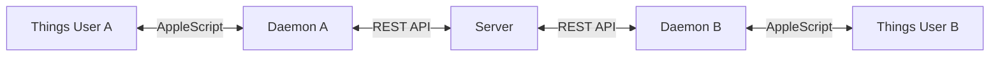

# shared-things

Sync a Things 3 project between multiple users via a central server.



## How It Works

1. Each user runs a local **daemon** that polls Things every 30 seconds
2. Changes are pushed to a central **server** (your own Hetzner VPS)
3. Other users pull changes and apply them locally via Things URL Scheme
4. Server is the **single source of truth** - last write wins on conflicts

## What Gets Synced

Within the shared project:
- Todos (title, notes, due date, tags, status)
- Headings (title, order)

Not synced:
- Checklist items (kept local)
- Areas (project must exist in both Things apps)

## Architecture

```
shared-things/
├── packages/
│   ├── common/      # Shared types & validation
│   ├── server/      # REST API + SQLite (runs on Hetzner)
│   └── daemon/      # macOS client (runs locally)
└── package.json     # pnpm workspace root
```

## Setup

### Server (Hetzner VPS)

```bash
# On your server
git clone <repo>
cd shared-things
pnpm install
pnpm --filter server build

# Create first user
pnpm --filter server run create-user --name "yonnock"
# → Returns API key

# Start with systemd (see docs/DEPLOYMENT.md)
```

### Client (macOS)

```bash
# On your Mac
npm install -g shared-things

# Initialize
shared-things init
# → Enter server URL
# → Enter your API key
# → Select Things project to share

# Install daemon (runs at login)
shared-things install

# Done! Changes sync automatically
```

## Commands

| Command | Description |
|---------|-------------|
| `init` | Setup wizard (server URL, API key, project) |
| `install` | Install launchd daemon (auto-start) |
| `uninstall` | Remove launchd daemon |
| `status` | Show sync status & last sync time |
| `sync` | Force immediate sync |
| `logs` | Show daemon logs |

## Requirements

- **Server:** Linux VPS, Node.js 20+, Caddy (for HTTPS)
- **Client:** macOS, Things 3 (URL Scheme enabled), Node.js 18+

## Security

- Each user has their own API key
- All traffic over HTTPS
- Server tracks who changed what (audit trail)

## License

MIT
