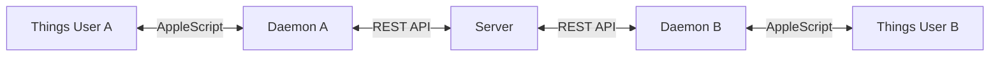

# shared-things

Sync a Things 3 project between multiple users via a central server.



## How It Works

1. Each user runs a local **daemon** that polls Things every 30 seconds
2. Changes are pushed to a central **server** (your own VPS or local machine)
3. Other users pull changes and apply them locally via Things URL Scheme
4. Server is the **single source of truth** - last write wins on conflicts

## What Gets Synced

Within the shared project:
- Todos (title, notes, due date, tags, status)
- Headings (title, order)

Not synced:
- Checklist items (kept local)
- Areas (project must exist in both Things apps)

## Quick Start

### Server Setup (one person hosts)

```bash
# Install
npm install -g shared-things-server

# Create users
shared-things-server create-user
# Interactive prompt for username, returns API key

# Start server
shared-things-server start --port 3334
```

For production, use a process manager like systemd or pm2.

### Client Setup (each user)

```bash
# Install
npm install -g shared-things-daemon

# Configure
shared-things init
# Interactive setup wizard:
# → Server URL: https://your-server.com (or http://localhost:3334)
# → API Key: <your key from server setup>
# → Project: <Things project to sync>
# → Things Token: <from Things → Settings → General → Things URLs>

# Start daemon (auto-starts on login)
shared-things install
```

### Updating

```bash
npm update -g shared-things-daemon
npm update -g shared-things-server
```

## Client Commands

| Command | Description |
|---------|-------------|
| `shared-things init` | Setup wizard |
| `shared-things install` | Install launchd daemon (auto-starts on login) |
| `shared-things uninstall` | Remove launchd daemon |
| `shared-things status` | Show sync status & last sync time |
| `shared-things sync` | Force immediate one-time sync |
| `shared-things logs [-f]` | Show daemon logs |
| `shared-things reset [--server]` | Reset sync state (--server also clears server data) |
| `shared-things purge` | Remove all local config and data |

## Server Commands

| Command | Description |
|---------|-------------|
| `shared-things-server start` | Start the sync server |
| `shared-things-server create-user` | Create user and generate API key |
| `shared-things-server list-users` | List all users |
| `shared-things-server delete-user` | Delete a user and their data |

## Server Endpoints

| Endpoint | Description |
|----------|-------------|
| `GET /health` | Health check (no auth required) |
| `GET /state` | Get full project state |
| `GET /delta?since=<timestamp>` | Get changes since timestamp |
| `POST /push` | Push local changes |
| `DELETE /reset` | Delete all user data |

All endpoints except `/health` require `Authorization: Bearer <api-key>` header.

## Production Deployment

### Server with systemd

```bash
# Install globally
npm install -g shared-things-server

# Create systemd service
sudo tee /etc/systemd/system/shared-things.service << EOF
[Unit]
Description=shared-things sync server
After=network.target

[Service]
Type=simple
User=www-data
ExecStart=/usr/bin/shared-things-server start --port 3334
Restart=always

[Install]
WantedBy=multi-user.target
EOF

# Enable and start
sudo systemctl daemon-reload
sudo systemctl enable shared-things
sudo systemctl start shared-things
```

### HTTPS with Caddy

Add to `/etc/caddy/Caddyfile`:

```
things.yourdomain.com {
    reverse_proxy localhost:3334
}
```

Then `sudo systemctl reload caddy`.

## Configuration

Client config is stored in `~/.shared-things/config.json`:

```json
{
  "serverUrl": "https://things.yourdomain.com",
  "apiKey": "your-api-key",
  "projectName": "Shared Project",
  "pollInterval": 30,
  "thingsAuthToken": "your-things-token"
}
```

Server data is stored in `~/.shared-things-server/data.db` (SQLite).

## Requirements

- **Server:** Linux/macOS, Node.js 18+
- **Client:** macOS, Things 3, Node.js 18+
- **Things:** URL Scheme must be enabled (Settings → General → Things URLs)

## Architecture

```
shared-things/
├── packages/
│   ├── common/      # Shared types & validation
│   ├── server/      # REST API + SQLite
│   └── daemon/      # macOS client
└── package.json     # pnpm workspace root
```

## Security

- Each user has their own API key (hashed in database)
- All traffic should be over HTTPS in production
- Server tracks who changed what (`updatedBy` field)

## License

MIT
