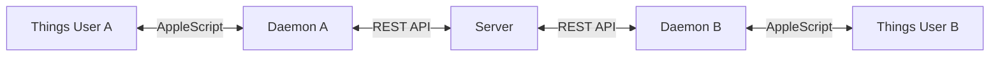

<p align="center">
  
  
  
</p>

# shared-things

**Sync a Things 3 project between multiple macOS users in real-time.**

Share todos with your team, family, or collaborators. Each person runs a lightweight daemon that syncs changes to a central server every 30 seconds. No cloud subscription required - host it yourself.



## Features

- **Real-time sync** - Changes propagate within 30 seconds
- **Self-hosted** - Run the server on your own VPS or local machine
- **Multi-user** - Each user gets their own API key
- **Conflict resolution** - Server is the single source of truth (last write wins)
- **Background daemon** - Auto-starts on login, runs silently
- **Interactive CLI** - Easy setup wizard and management commands

## Quick Start

### Server Setup (one person hosts)

```bash
# Install
npm install -g shared-things-server

# Create users
shared-things-server create-user
# Interactive prompt for username, returns API key

# Start server in background
shared-things-server start -d --port 3334
shared-things-server status   # Check if running
shared-things-server logs -f  # Follow logs
```

### Client Setup (each user)

```bash
# Install
npm install -g shared-things-daemon

# Configure (interactive wizard)
shared-things init

# Start daemon (auto-starts on login)
shared-things install
```

## Client Commands

| Command | Description |
|---------|-------------|
| `shared-things init` | Setup wizard |
| `shared-things install` | Install launchd daemon (auto-starts on login) |
| `shared-things uninstall` | Remove launchd daemon |
| `shared-things status` | Show sync status & last sync time |
| `shared-things sync` | Force immediate one-time sync |
| `shared-things logs [-f]` | Show daemon logs |
| `shared-things reset [--server]` | Reset sync state (--server also clears server data) |
| `shared-things purge` | Remove all local config and data |

## Server Commands

| Command | Description |
|---------|-------------|
| `shared-things-server start [-d] [-p port]` | Start server (-d for background mode) |
| `shared-things-server stop` | Stop background server |
| `shared-things-server status` | Show server status (running, PID, users, todos) |
| `shared-things-server logs [-f]` | Show server logs (-f to follow) |
| `shared-things-server create-user` | Create user and generate API key |
| `shared-things-server list-users` | List all users |
| `shared-things-server delete-user` | Delete a user and their data |
| `shared-things-server list-todos [-u user]` | List all todos (--user to filter) |
| `shared-things-server reset` | Delete all todos/headings (keeps users) |
| `shared-things-server purge` | Delete entire database |

## What Gets Synced

Within the shared project:
- Todos (title, notes, due date, tags)
- Headings (title, order)

Not synced:
- Completed todos (Things API limitation)
- Checklist items (kept local)
- Areas (project must exist in both Things apps)

## Requirements

- **Server:** Linux/macOS, Node.js 18+
- **Client:** macOS, Things 3, Node.js 18+
- **Things:** URL Scheme must be enabled (Settings → General → Things URLs)

<details>
<summary><strong>Production Deployment</strong></summary>

### Server with systemd

```bash
# Create systemd service
sudo tee /etc/systemd/system/shared-things.service << EOF
[Unit]
Description=shared-things sync server
After=network.target

[Service]
Type=simple
User=www-data
ExecStart=/usr/bin/shared-things-server start --port 3334
Restart=always

[Install]
WantedBy=multi-user.target
EOF

# Enable and start
sudo systemctl daemon-reload
sudo systemctl enable shared-things
sudo systemctl start shared-things
```

### HTTPS with Caddy

Add to `/etc/caddy/Caddyfile`:

```
things.yourdomain.com {
    reverse_proxy localhost:3334
}
```

Then `sudo systemctl reload caddy`.

</details>

<details>
<summary><strong>Configuration Files</strong></summary>

Client config (`~/.shared-things/config.json`):

```json
{
  "serverUrl": "https://things.yourdomain.com",
  "apiKey": "your-api-key",
  "projectName": "Shared Project",
  "pollInterval": 30,
  "thingsAuthToken": "your-things-token"
}
```

Server data: `~/.shared-things-server/data.db` (SQLite)

</details>

<details>
<summary><strong>API Endpoints</strong></summary>

| Endpoint | Description |
|----------|-------------|
| `GET /health` | Health check (no auth required) |
| `GET /state` | Get full project state |
| `GET /delta?since=<timestamp>` | Get changes since timestamp |
| `POST /push` | Push local changes |
| `DELETE /reset` | Delete all user data |

All endpoints except `/health` require `Authorization: Bearer <api-key>` header.

</details>

## Security

- Each user has their own API key (hashed in database)
- All traffic should be over HTTPS in production
- Server tracks who changed what (`updatedBy` field)

## Contributing

Issues and PRs welcome! This is a monorepo using pnpm workspaces:

```bash
git clone https://github.com/yungweng/shared-things.git
cd shared-things
pnpm install
pnpm build
```

## License

MIT
