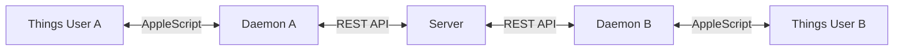

# shared-things

Sync a Things 3 project between multiple users via a central server.



## How It Works

1. Each user runs a local **daemon** that polls Things every 30 seconds
2. Changes are pushed to a central **server** (your own Hetzner VPS)
3. Other users pull changes and apply them locally via Things URL Scheme
4. Server is the **single source of truth** - last write wins on conflicts

## What Gets Synced

Within the shared project:
- Todos (title, notes, due date, tags, status)
- Headings (title, order)

Not synced:
- Checklist items (kept local)
- Areas (project must exist in both Things apps)

## Architecture

```
shared-things/
├── packages/
│   ├── common/      # Shared types & validation
│   ├── server/      # REST API + SQLite (runs on Hetzner)
│   └── daemon/      # macOS client (runs locally)
└── package.json     # pnpm workspace root
```

## Quick Start

### 1. Server Setup

```bash
# Clone and build
git clone https://github.com/moto-nrw/shared-things.git
cd shared-things
pnpm install
pnpm build

# Start server (default port 3000)
cd packages/server
node dist/index.js

# Or with custom port
PORT=3333 node dist/index.js
```

### 2. Create Users

```bash
cd packages/server

# Create a user - save the API key!
node dist/cli.js create-user --name "yonnock"
# → ID:      abc123...
# → API Key: xyz789...  ← Save this!

node dist/cli.js create-user --name "florian"
# → Different API key for each user

# List all users
node dist/cli.js list-users
```

### 3. Client Setup (macOS)

```bash
# Install globally
cd packages/daemon
pnpm link --global

# Run setup wizard
shared-things init
```

The wizard will ask for:
1. **Server URL** - e.g., `http://localhost:3333` or `https://things.yourdomain.com`
2. **API Key** - your personal key from step 2
3. **Things Project** - which project to sync (must exist in Things)
4. **Things Auth Token** - from Things → Settings → General → Things URLs → Manage

### 4. Start the Daemon

```bash
# Install as LaunchAgent (auto-starts on login)
shared-things install

# Or run manually for testing
shared-things sync
```

## Commands

| Command | Description |
|---------|-------------|
| `init` | Setup wizard (server URL, API key, project, Things token) |
| `install` | Install launchd daemon (auto-starts on Mac login) |
| `uninstall` | Remove launchd daemon |
| `status` | Show sync status & last sync time |
| `sync` | Force immediate one-time sync |
| `logs` | Show daemon logs (`-f` to follow) |
| `daemon` | Run sync loop (used internally by launchd) |

## Server Endpoints

| Endpoint | Description |
|----------|-------------|
| `GET /health` | Health check (no auth required) |
| `GET /state` | Get full project state |
| `GET /delta?since=<timestamp>` | Get changes since timestamp |
| `POST /push` | Push local changes |

All endpoints except `/health` require `Authorization: Bearer <api-key>` header.

## Configuration

Config is stored in `~/.shared-things/config.json`:

```json
{
  "serverUrl": "https://things.yourdomain.com",
  "apiKey": "your-api-key",
  "projectName": "Shared Project",
  "pollInterval": 30,
  "thingsAuthToken": "your-things-token"
}
```

## Requirements

- **Server:** Linux/macOS, Node.js 18+
- **Client:** macOS, Things 3, Node.js 18+
- **Things:** URL Scheme must be enabled (Settings → General → Things URLs)

## Documentation

- [Server Deployment](docs/DEPLOYMENT.md) - Hetzner VPS setup with Caddy & systemd
- [Client Setup](docs/CLIENT.md) - macOS daemon installation & troubleshooting

## Security

- Each user has their own API key (hashed in database)
- All traffic should be over HTTPS in production
- Server tracks who changed what (`updatedBy` field)

## License

MIT
