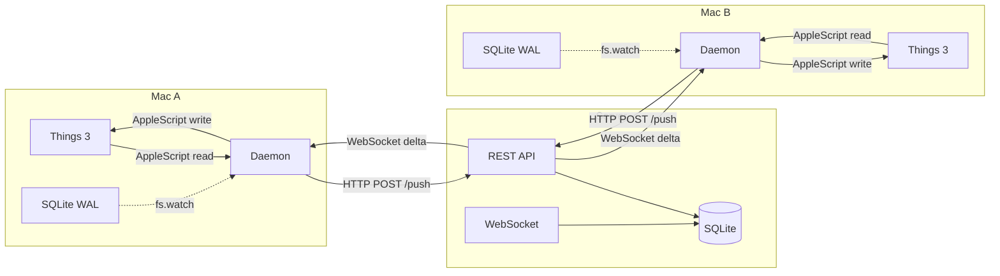

# shared-things

**Sync a Things 3 project between multiple macOS users — in real time.**

Stop duplicating todos manually. shared-things keeps your team's Things 3 project in sync via a lightweight self-hosted server. Changes arrive within seconds, not minutes.

## Architecture


```mermaid
graph LR
    subgraph "Mac A"
        T1[Things 3] -->|AppleScript read| D1[Daemon]
        D1 -->|AppleScript write| T1
        WAL1[SQLite WAL] -.->|fs.watch| D1
    end

    subgraph Server
        API[REST API]
        WS[WebSocket]
        DB[(SQLite)]
        API --> DB
        WS --> DB
    end

    subgraph "Mac B"
        T2[Things 3] -->|AppleScript read| D2[Daemon]
        D2 -->|AppleScript write| T2
        WAL2[SQLite WAL] -.->|fs.watch| D2
    end

    D1 -->|HTTP POST /push| API
    API -->|WebSocket delta| D2
    D2 -->|HTTP POST /push| API
    API -->|WebSocket delta| D1
```

**How it works:**

1. You create/edit/delete a todo in Things
2. The daemon detects the change instantly via file watcher (Things SQLite WAL)
3. Pushes the change to the server via REST
4. Server notifies your colleague's daemon via WebSocket
5. Their daemon creates/updates/deletes the todo in their Things via AppleScript

No polling. Changes propagate in ~1 second.

## Prerequisites

- **macOS** with [Things 3](https://culturedcode.com/things/) installed
- **Node.js >= 18** and **pnpm**
- A server (VPS, Docker, or local machine) for the sync server

## Setup Guide

### Step 1: Deploy the Server

Choose one option:

**Option A: Docker (recommended)**

```bash
git clone https://github.com/yungweng/shared-things.git
cd shared-things
docker compose up -d
```

**Option B: Direct**

```bash
git clone https://github.com/yungweng/shared-things.git
cd shared-things
pnpm install && pnpm build
node packages/server/dist/cli.js start -d --port 3334
```

### Step 2: Create Users

```bash
# Docker
docker compose exec shared-things \
  node packages/server/dist/cli.js create-user -n alice

# Direct
node packages/server/dist/cli.js create-user -n alice
```

Save the API key — it can't be retrieved later. Repeat for each user.

### Step 3: Prepare Things

On **each Mac**:

1. Open Things 3
2. Create a new, **empty** project (e.g. "Shared Things")
3. Go to **Things > Settings > General > Things URLs > Manage**
4. Copy the auth token

> The project must have the same name on every Mac.

### Step 4: Install the Daemon

On **each Mac**:

```bash
git clone https://github.com/yungweng/shared-things.git
cd shared-things
pnpm install && pnpm build

node packages/daemon/dist/cli.js init
```

The wizard will ask for:

| Prompt | What to enter |
|--------|--------------|
| Server URL | `https://your-server:3334` |
| API Key | The key from Step 2 |
| Things project | Select the empty project from Step 3 |
| Things Auth Token | The token from Step 3 |

The wizard offers to install a LaunchAgent so the daemon starts automatically on login.

### Step 5: Verify

```bash
# Check that everything is connected
node packages/daemon/dist/cli.js doctor

# Watch the sync logs
tail -f ~/.shared-things/sync.log
```

Create a todo in the shared Things project — it should appear on the other Mac within ~1 second.

## Client Commands

| Command | Description |
|---------|-------------|
| `init` | Setup wizard |
| `start` | Start daemon (auto-starts on login) |
| `stop` | Stop daemon |
| `status` | Show sync status and connection state |
| `sync` | Force one-time sync |
| `logs [-f]` | Show logs (`-f` to follow) |
| `conflicts [--all]` | Show conflict history |
| `doctor` | Health check |
| `reset --local` | Clear local state (re-sync from server) |
| `reset --server` | Clear your data on the server |

## Server Commands

| Command | Description |
|---------|-------------|
| `start [-d] [-p port]` | Start server (`-d` for background) |
| `stop` | Stop background server |
| `status` | Show status and connected clients |
| `create-user [-n name]` | Create user and generate API key |
| `list-users` | List all users |
| `delete-user` | Delete a user and their data |
| `list-todos [-u user]` | List all todos |
| `reset` | Delete all todos (keeps users) |
| `purge` | Delete entire database |

## What Syncs

| Synced | Not Synced |
|--------|------------|
| Title, notes, due date, tags, status | Checklist items |
| Creation, updates, deletion | Headings, areas |
| Position/ordering | Repeating tasks |

> Deletion moves todos to the Things trash (Papierkorb). It does not permanently delete them.

## How Sync Works

- **Local change detection:** `fs.watch` on the Things SQLite WAL file (with 60s fallback poll)
- **Client → Server:** `POST /push` with changed todos
- **Server → Client:** WebSocket pushes deltas to connected clients
- **Conflict resolution:** Last write wins, with user ID as tiebreaker for equal timestamps
- **ID mapping:** Server assigns UUIDs; each daemon maps them to local Things IDs

## Production Deployment

<details>
<summary><strong>HTTPS with Caddy</strong></summary>

```
things.yourdomain.com {
    reverse_proxy localhost:3334
}
```

</details>

<details>
<summary><strong>systemd Service</strong></summary>

```bash
sudo tee /etc/systemd/system/shared-things.service << 'EOF'
[Unit]
Description=shared-things sync server
After=network.target

[Service]
Type=simple
ExecStart=/usr/bin/node /path/to/shared-things/packages/server/dist/cli.js start --port 3334
Restart=always

[Install]
WantedBy=multi-user.target
EOF

sudo systemctl enable --now shared-things
```

</details>

## Development

```bash
git clone https://github.com/yungweng/shared-things.git
cd shared-things
pnpm install
pnpm build     # Build all packages
pnpm dev       # Watch mode
pnpm lint      # Check with Biome
pnpm typecheck # TypeScript check
```

## License

MIT
